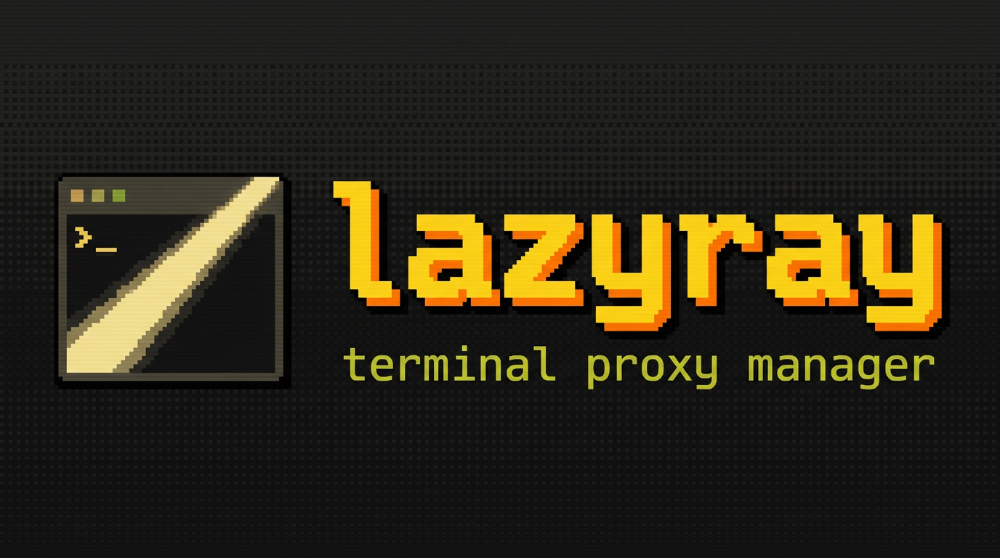

<p align="center">
  
</p>

<h1 align="center">lazyray</h1>

<p align="center">
  <b>Terminal UI for managing Xray-core proxy configurations</b><br>
  <sub>A lazygit-inspired terminal interface for Xray-core. Manage proxy profiles, monitor traffic, and control your network — all from the terminal.</sub>
</p>

<p align="center">
  <a href="https://go.dev/"></a>
  <a href="https://github.com/rtxnik/lazyray/releases/latest"></a>
  <a href="LICENSE"></a>
  <a href="https://github.com/rtxnik/lazyray/actions"></a>
  <a href="https://goreportcard.com/report/github.com/rtxnik/lazyray"></a>
</p>

---

## Features

### 🔌 Multi-Protocol Support

VLESS, VMess, Trojan, Shadowsocks — import via URL or subscription, manage in one place.

### 🚀 Full TUI Experience

Three-panel layout with profiles, status, and logs. Modal dialogs for editing, health checks, QR export. Keyboard-driven navigation.

### 🌐 System Proxy Integration

`lzr proxy on/off/status` — configure OS-level proxy on macOS, Linux (GNOME/KDE), and Windows. PAC auto-configuration included.

### 🔒 DNS Security

DNS-over-HTTPS and DNS-over-TLS with per-profile conditional routing rules.

### 📊 Traffic Monitoring

Real-time upload/download stats, persistent traffic history, speed testing through proxy.

### 🔄 Subscription Management

Import from subscription URLs with auto-refresh. Batch latency testing and auto-sort.

### 🎨 Customizable

Multiple themes (Gruvbox, Nord, Catppuccin, Solarized), custom keybindings, responsive layout for small terminals.

### 💻 Cross-Platform

macOS (launchd), Linux (systemd), Windows (Task Scheduler). System service install/uninstall.

## Installation

The binary is named **`lzr`**. Every published release is shipped with a
minisign-signed checksum manifest (`checksums.txt` + `checksums.txt.minisig`),
and the install paths below verify it before installing.

### Homebrew (macOS / Linux)

```bash
brew install rtxnik/tap/lzr
```

Homebrew downloads from the signed GitHub release and the formula is published
from our tap (`rtxnik/homebrew-tap`). xray-core is **not** bundled — fetch it
once after install with `lzr update apply`.

### Linux packages (deb / rpm / apk)

Download the matching package for your architecture from
[**Releases**](https://github.com/rtxnik/lazyray/releases/latest), then:

```bash
sudo dpkg -i  lazyray_<version>_linux_amd64.deb     # Debian / Ubuntu
sudo rpm -i   lazyray_<version>_linux_amd64.rpm     # Fedora / RHEL / openSUSE
sudo apk add --allow-untrusted lazyray_<version>_linux_amd64.apk   # Alpine
```

Packages install the `lzr` binary, shell completions, and the man page. They do
**not** register or start any background service and never require root for
config — the proxy service is user-scoped (`lzr service install`, run as your
user). After installing, run `lzr update apply` to fetch xray-core.

### Install script (Linux / macOS)

```bash
curl -fsSL https://raw.githubusercontent.com/rtxnik/lazyray/main/scripts/install.sh | sh
```

The script **always** verifies the archive's SHA-256 against the signed
`checksums.txt`. If the `minisign` tool is present on your machine it
**additionally** verifies `checksums.txt.minisig` against the public key
embedded in the script — the full supply-chain check. If `minisign` is absent
the script prints a loud warning and continues at checksum-only level.

> **Trust model (honest note):** a bare `curl … | sh` *without* `minisign`
> installed gives only checksum-level integrity (protects against corruption,
> MITM-beyond-TLS, and tampered mirrors) — **not** against a compromised
> release. The strongly-verified paths are Homebrew, the Linux packages, and
> `install.sh` with `minisign` present. To make a missing `minisign` a hard
> error instead of a warning:

```bash
curl -fsSL https://raw.githubusercontent.com/rtxnik/lazyray/main/scripts/install.sh \
  | sh -s -- --require-signature
```

### go install

```bash
go install github.com/rtxnik/lazyray@latest
```

> **Note:** `go install` produces a binary named **`lazyray`**, not `lzr`
> (Go names the binary after the module path), and it is built without the
> release version stamp or signature verification. All other channels install
> `lzr`. Symlink it if you want the canonical name:
> `ln -s "$(go env GOPATH)/bin/lazyray" "$(go env GOPATH)/bin/lzr"`.

### Build from source

```bash
git clone https://github.com/rtxnik/lazyray.git
cd lazyray
make build    # produces ./lzr
```

## Quick Start

```bash
# Launch TUI — onboarding wizard guides first-time setup
lzr

# Import a proxy profile
lzr import "vless://uuid@host:port?params#name"

# Start the proxy
lzr start

# Check status
lzr status

# Show your exit IP
lzr ip
```

## Concepts

A few terms recur throughout lazyray and its docs:

- **proxy profile** — a saved connection definition (protocol, transport, security) in `servers.yaml`. Most commands act on a profile.
- **proxy server** — the remote endpoint a profile connects to.
- **system proxy** — your OS-level proxy settings, toggled with `lzr proxy on`/`off` (separate from a proxy profile).
- **xray-core** — the proxy engine `lzr` drives; the generated **xray config** is the JSON `lzr` builds from your active profile.
- **profile store** — the YAML config (`servers.yaml`, `lazyray.yaml`) where profiles and settings live.
- **SSH tunnel** — `lzr tunnel` opens an SSH tunnel to a server's admin panel; it does **not** route your traffic and is unrelated to the proxy itself.
- **diagnostics vs health** — `lzr doctor` is a full diagnostic sweep; `lzr health` is a quick connectivity probe of the active profile.

## CLI Commands

| Command | Description |
|---------|-------------|
| `lzr` | Launch interactive TUI |
| `lzr start [--background]` | Start xray proxy |
| `lzr stop` | Stop xray proxy |
| `lzr restart` | Restart xray proxy |
| `lzr status [--json]` | Show proxy status |
| `lzr health [--json]` | Run health check |
| `lzr ip [--json]` | Show proxy vs direct IP |
| `lzr import <url>` | Import proxy URL |
| `lzr import --sub <url>` | Import from subscription |
| `lzr export [name] [--qr]` | Export URL or QR code |
| `lzr config list` | List profiles |
| `lzr config switch <name>` | Switch active profile |
| `lzr config show` | Show xray config |
| `lzr config edit` | Open config in $EDITOR |
| `lzr config backup` | Backup all configs |
| `lzr config restore <path>` | Restore from backup |
| `lzr config delete <name>` | Delete a profile |
| `lzr config duplicate <name>` | Duplicate a profile |
| `lzr test [name] [--all]` | Test connection / batch latency |
| `lzr speedtest` | Download speed test through proxy |
| `lzr stats` | Show traffic statistics |
| `lzr logs` | Tail xray logs |
| `lzr proxy on/off/status` | System proxy management |
| `lzr pac generate` | Generate PAC file |
| `lzr pac serve [--system]` | Serve PAC over HTTP |
| `lzr tunnel <name>` | Open SSH tunnel |
| `lzr tunnel close` | Close all tunnels |
| `lzr update check` | Check for xray-core updates |
| `lzr update apply` | Download and install update |
| `lzr service install/uninstall` | Manage autostart service |
| `lzr self-update` | Update lazyray to latest release |

### Hysteria2 links

`lzr import` accepts `hysteria2://` / `hy2://` links with these parameters:

- `obfs=salamander` + `obfs-password` — salamander obfuscation (the only type xray-core supports).
- `sni`, `pinSHA256` — TLS. Prefer `pinSHA256` (hex cert fingerprint): xray-core >= v26 removed `insecure` / `allowInsecure`.
- Inline port-hopping in the `host:port` slot, e.g. `host:443,5000-6000`.
- `alpn`, `fp` are accepted as non-standard extensions.

Hysteria2 requires a hysteria2-capable xray-core (>= 26.2.6); `lzr` blocks startup on older builds. The pinned default fetched by `lzr update apply` (`v26.3.27`) already satisfies this. See `test/e2e/hysteria2/README.md` for the e2e harness.

## Configuration

Configuration files are stored in `~/.config/lazyray/` (macOS/Linux) or `%APPDATA%\lazyray\` (Windows):

| File | Purpose |
|------|---------|
| `servers.yaml` | Server profiles — protocols, transport, security, routing |
| `lazyray.yaml` | Application settings — ports, health checks, UI, subscriptions |
| `keys.yaml` | Custom keybinding overrides (optional) |

Data files (xray binary, logs, backups) are stored in `~/.local/share/lazyray/` (macOS/Linux) or `%LOCALAPPDATA%\lazyray\` (Windows).

See the [configuration reference](docs/reference/configuration.md) for every setting.

## Troubleshooting

Hit a snag? See [TROUBLESHOOTING.md](TROUBLESHOOTING.md) for the common cases
(removed `allowInsecure`, Hysteria2 version gate, missing geo data, macOS
Gatekeeper, Linux system proxy, headless use). `lzr doctor` diagnoses most
problems in one pass.

## Documentation

- [Command reference](docs/reference/cli/lzr.md) — generated
- [Keybindings reference](docs/reference/keybindings.md) — generated
- [Configuration reference](docs/reference/configuration.md)
- [Exit codes](docs/reference/exit-codes.md)
- [Architecture](docs/ARCHITECTURE.md) — code map, invariants, dependency graph
- [Contributing](CONTRIBUTING.md) — dev setup, tests, the project's invariants
- [Security policy](SECURITY.md) — reporting, trust model, release verification

## Requirements

- [Xray-core](https://github.com/XTLS/Xray-core) — downloaded automatically via `lzr update apply`, pinned to a known-good version (default `v26.3.27`); override with `lzr update apply --version <tag>`. The download is verified against XTLS's published `.dgst` SHA-256 checksum before it is executed.
- Go 1.24+ (building from source only)

## License

[MIT](LICENSE)

<p align="center">
  
</p>
