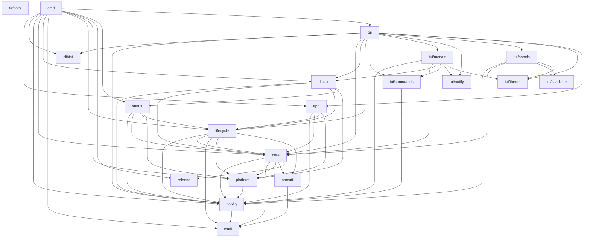

# Architecture

This document is the contributor's map of `lazyray`. It describes what the
binary does, how a request flows through it, how the code is laid out, and the
invariants that keep the layout honest. Read it before making a non-trivial
change; the [Extension Points](#extension-points) section tells you which test
guards a given kind of change must satisfy.

Files are named, not line-linked, so this map does not rot every time a function
moves a few lines.

## Bird's-Eye View

`lzr` is a cross-platform Go program for managing [Xray-core](https://github.com/XTLS/Xray-core)
client proxies. It is both a CLI and a full-screen [Bubble Tea](https://github.com/charmbracelet/bubbletea)
terminal UI: run `lzr <subcommand>` for scripting, or run `lzr` with no
subcommand to drop into the TUI.

- Binary: `lzr`
- Module: `github.com/rtxnik/lazyray`

A profile in `lzr` describes a single client connection to a proxy server.
`lzr` reads that profile, generates an Xray-core configuration, and supervises
the local `xray` process, which exposes SOCKS5 and HTTP proxies on localhost.

`lzr` can also describe a **proxy cascade**: a client whose traffic enters
through one server and leaves through another, optionally chaining several hops.
Conceptually:

```
your machine (xray client)
  → entry server (the profile's server)
  → optional intermediate hops (the profile's chain)
  → exit server
  → the internet (with the exit server's IP)
```

Each hop is an Xray outbound that references the next hop by tag. The cascade is
a property of the profile, not of `lzr`'s process model: `lzr` always runs one
local `xray` client and points your applications at its localhost ports.

### Scope / Non-goals

`lzr` is deliberately small. It does **not**:

- act as a proxy **server** or manage remote servers — it is a client only.
- create a **TUN/VPN** interface — it exposes SOCKS5 and HTTP proxies on
  localhost, nothing more.
- route **all** system traffic transparently — applications opt in by using the
  localhost proxy (directly, via the OS system-proxy setting `lzr` can toggle,
  or via tools like proxychains).
- run as a **root daemon** — the resident supervisor is user-scoped, and
  autostart is wired through the per-user system-service mechanism, not a
  privileged background service.

## Entry Points

There are two front doors. Both begin in `main.go`, a 14-line stub that sets the
build version and calls `cmd.Execute()`.

**CLI path.** `cmd.Execute` (`cmd/root.go`) runs the Cobra root command
(`Use: "lzr"`). When a command returns an error, `Execute` is the single place
that renders it: it calls `clihint.Render(os.Stderr, err)` to print the message
plus an actionable hint, then `exitCodeFor(err)` to resolve the process exit
code. `os.Exit` is called only here, from `main` — no package below `cmd` exits
the process.

**TUI path.** With no subcommand, the root command builds the app:
`tui.NewApp(version)` constructs the top-level Bubble Tea model, then
`tea.NewProgram(..., tea.WithAltScreen())` runs it. `NewApp` loads config,
applies the active theme, builds the panels, and constructs the command registry
with `commands.New(commands.DefaultKeyMap())`. `App.Update` is the Bubble Tea
reducer: it routes modal-first, then falls through to a `tea.KeyMsg` switch.

### Life of a keypress

1. A `tea.KeyMsg` reaches `App.Update`. If a modal is open, the message goes to
   `a.modal.Update` and never reaches the panels.
2. With no modal, control reaches the `case tea.KeyMsg` arm. Input-capture modes
   (rename, search, log-filter) intercept the key first so typing is not
   mistaken for a hotkey.
3. Otherwise the key is handed to `a.handleKeyPress(msg)`.
4. `handleKeyPress` is one `switch` over `key.Matches(msg, a.keys.X)` bindings,
   mapping each binding to its action — e.g. `Doctor` opens the doctor modal,
   `Palette` opens the command palette.
5. The same `commands.KeyMap` is mirrored into the `Registry` via
   `commands.New(km)`. The registry is the single source for the hotkeys bar,
   the help modal, and the palette, so they can never drift from the live key
   bindings.
6. The palette closes the loop: `launchCommand(c)` focuses the command's scope
   panel via `panelForScope`, then re-injects the command's primary key back
   through the **same** `handleKeyPress` using `synthKey`. A palette launch and a
   direct keypress therefore take the identical code path.

## Code Map

Packages are listed in dependency order — leaves first, then mid-level, then the
top-level app, then the standalone packages that nothing else imports. Each entry
names its key files and, where the layering depends on it, states an
**Invariant** as the absence of something. The dependency graph is acyclic; see
the [C4 component diagram](#c4-component-diagram) for the full edge set.

### Leaf packages

**`internal/config`** — on-disk paths, server-profile parse/serialize, and
settings. Key files: `paths.go`, `servers.go`, `settings.go`. Owns the
`servers.yaml` schema (current `CurrentConfigVersion = 2`), profile fields
(server address, UUID/keys with `0600` permissions, transport/reality settings,
optional multi-hop `chain`, routing rules), the `settings.yaml` defaults
(including `AutoSystemProxy`, default `true`), and the per-OS data/config/cache
paths and autostart asset locations. *Invariant:* imports no other `internal/`
package except the stdlib-only leaf `fsutil` (for atomic writes), and never
spawns a process or touches the network.

**`internal/platform`** — per-OS system-proxy toggling, system-service
(autostart) registration, and OS detection, all behind one interface. Key files:
`platform.go`, `sysproxy.go`, and the `darwin`/`linux`/`windows` build-tagged
backends (`darwin.go`, `linux.go`, `windows.go`, `sysproxy_darwin.go`,
`sysproxy_linux.go`, `sysproxy_windows.go`). *Invariant:* depends only on
`config`; never parses server URIs.

**`internal/tui/theme`** — the color palette and the lipgloss styles derived from
it. Key file: `theme.go`. Ships four themes — `gruvbox-dark` (default), `nord`,
`catppuccin`, `solarized`. *Invariant:* the only legal home for
`lipgloss.Color("#…")` literals (Guard G4); has zero `internal/` imports.

**`internal/tui/notify`** — a bounded in-memory notice ring for transient UI
messages. Key files: `notice.go`, `log.go`. Severity is carried by color, never
by a glyph; consecutive identical notices coalesce. *Invariant:* imports nothing
from `panels` or `modals`, so it introduces no TUI dependency cycle.

**`internal/tui/sparkline`** — a pure block-unicode sparkline renderer for the
dashboard's speed/latency history. *Invariant:* zero `internal/` imports and no
I/O.

### Mid-level packages

**`internal/core`** — the proxy engine. Key files: `config.go` (Xray
config-gen), the protocol parsers `vless.go`, `vmess.go` (also Trojan via
`ParseTrojan`), `shadowsocks.go`, `hysteria2.go`, with `ParseProxyURL`
dispatching by scheme; `health.go` (a health check covering process, SOCKS5/HTTP
ports, exit IP, DNS leak, and latency); `stats.go`, `speedtest.go`,
`subscription.go` (subscription import and `ParseSubscriptionBody`), `pac.go`
(PAC generation), and the self-updater. The self-updater
(`updater.go`/`selfupdate.go`/`selfupdate_extract.go`) downloads the xray-core
and `lzr` archives and **verifies a SHA-256 checksum and minisign signature
before** extracting or swapping any binary — `ApplySelfUpdate` calls
`release.VerifyRelease` and fails closed on mismatch. *Invariant:* never calls
`os.Exit`; imports no `tui`, `lifecycle`, `doctor`, or `status`.

**`internal/lifecycle`** — the resident supervisor. Key files: `state.go`,
`lock_unix.go` (and its Windows counterpart). Holds an advisory `flock` on
`supervisor.lock` for single-instance enforcement and treats `state.json` as the
source of truth for what is running; it spawns and tears down the `xray`
process. *Invariant:* never calls `os.Exit`; depends on `config`, `core`, and
`platform`, not on `status`, `doctor`, or `tui`.

**`internal/status`** — assembles the structured proxy-status snapshot that
`lzr status` and the TUI render. *Invariant:* imported only by `cmd` and
`doctor`; it does not print and does not derive exit codes.

**`internal/doctor`** — severity-graded diagnostic checks run over an injected
`Env`, surfaced by `lzr doctor` and the doctor modal. *Invariant:* never prints,
never calls `os.Exit`, and never kills foreign processes.

**`internal/tui/commands`** — the keymap and command registry that feed the help
modal, the palette, and the hotkeys bar. Key files: `keymap.go`, `registry.go`.
The `keymap.go` YAML overrides keep a `health:` alias for back-compat with the
renamed `doctor:` binding. *Invariant:* depends only on `config`; imports no
`panels`, `modals`, or `app`, so `tools/gen-docs` can consume the registry to
generate the keybindings reference without pulling in the whole TUI.

**`internal/tui/panels`** — the status, profiles, and logs sub-views. *Invariant:*
depends on `config`, `core`, `sparkline`, and `theme`, not on the parent `tui`
or on `modals`.

**`internal/tui/modals`** — the overlay dialogs. Key files include `doctor.go`,
`palette.go`, `help.go`, `wizard.go`, `wizard_nudge.go`, `import.go`,
`subscription.go`, `edit.go`, `qr.go`, `update.go`, `activity.go`,
`confirm.go`, `routing.go`, `diff.go`, `tunnel.go`. (Diagnostics live in the
**doctor** modal; there is no separate "health" modal.) *Invariant:* depends on
`config`, `core`, `doctor`, `commands`, `notify`, and `theme`, not on
the parent `tui`.

### Service layer

**`internal/app`** — the application-service layer: the single home for the
multi-step business flows both shells used to hand-sequence (import,
connect, disconnect, active-config write). Key files: `service.go`,
`import.go`, `lifecycle.go`. `Service` exposes `ImportProfile`,
`ImportSubscription`, `Connect`, `Disconnect`, and `WriteActiveConfig`;
dependencies are injected as plain function values (mirroring `doctor`'s
injected `Env`), so every flow is unit-tested without a network, a spawned
xray, or disk I/O. The CLI builds a throwaway `Service` per command via
`app.NewService()`; the TUI builds one per session and keeps it on `App`.
*Invariant:* imported only by `cmd` and `tui`; depends on `config`, `core`,
`lifecycle`, and `platform`, which never import it back (Guard G6 pins the
shell-side boundary).

### Top-level

**`internal/tui`** — the top-level Bubble Tea app model that wires everything
together. Key file: `app.go`. *Invariant:* never calls `os.Exit`; imported only
by `cmd`.

### Standalone packages

These have no `internal/` dependencies; they sit at the edge of the graph.
`clihint` is consumed by `cmd` and `tui`, `release` by `cmd` and `core`;
`refdocs` has no dependents at all.

**`internal/clihint`** — the single place command failures are formatted
(`Error{Msg, Hint}` plus `Render`). *Invariant:* pure, no global state, no
`internal/` imports.

**`internal/release`** — the offline release verifier. Key file: `verify.go`. It
checks a minisign signature and SHA-256 checksum against a public key embedded at
release time. *Invariant:* never reaches the network and never calls `os.Exit`.

**`internal/refdocs`** — documentation tests only: doc coverage, link integrity,
this file's C4 diagram freshness, and the shell/service layering guard (G6). *Invariant:* ships no production code and
imports no other `internal/` package.

## Invariants & Guards

Six guard tests turn the architectural rules above into compile-or-test
failures. Each is stated as an absence; each names its enforcing test by file
name.

- **G1 — KeyMap ↔ Registry bijection** (`internal/tui/commands/guard_test.go`,
  `TestRegistryMatchesKeyMap`). There is no `KeyMap` field without a matching
  `Registry` command ID, no command ID without a matching field, and no
  duplicate IDs.
- **G2 — dispatch completeness** (`internal/tui/commands/guard_test.go`,
  `TestDispatchReferencesMatchRegistry`). There is no registered command that is
  never dispatched via `.keys.<ID>` in `app.go`, and no `.keys.<Field>`
  dispatched that is absent from the registry.
- **G3 — single-rune launch key** (`internal/tui/commands/registry_test.go`,
  `TestLaunchablePrimaryKeyIsSingleRune`). There is no palette-`Launchable()`
  command whose primary key is empty or longer than a single rune, so
  `synthKey` re-injection is always safe.
- **G4 — no stray colors** (`internal/tui/theme/guard_test.go`,
  `TestNoHardcodedColorsOutsideThemePackage`). There is no non-test `.go` file
  under `internal/tui` outside `theme/` containing a `lipgloss.Color("#` literal.
- **G5 — scope auto-focus** (`internal/tui/app_test.go`,
  `TestLaunchCommandAutoFocusesScopePanel`). There is no palette-launched scoped
  command left on the wrong panel — `launchCommand` must leave `activePanel`
  equal to the panel its scope maps to via `panelForScope`.
- **G6 — shell/service layering** (`internal/refdocs/layering_guard_test.go`,
  `TestShellLifecycleUseIsAllowlisted`, `TestShellsDoNotBypassServiceOwnedFlows`,
  `TestOnlySanctionedPackagesImportLifecycle`). There is no direct `lifecycle`
  reference in the shells (`cmd`, `internal/tui`) outside an explicit per-file
  allowlist, no shell call to the `Service`-owned `core` entry points
  (`WriteXrayConfig`, `ImportSubscription`), and no package beyond `app`,
  `cmd`, `doctor`, `status`, `tui` importing `lifecycle` at all. The pinned
  exceptions are read-only liveness/state queries, `cmd/run.go` (the resident
  daemon host), and the graceful-signal path in `stop`/`restart`, whose
  hard-kill escalation `Service.Disconnect` deliberately omits.

## Cross-Cutting Concerns

Six seams cut across the package boundaries above.

- **Error funnel.** `clihint.Render` owns stderr at the single `cmd.Execute`
  exit point; exit codes are resolved separately by `exitCodeFor`. Commands
  return errors; they do not print or exit themselves.
- **Notify ring.** `internal/tui/notify` is a bounded, single-threaded notice
  log that coalesces consecutive identical notices. Severity is encoded as color.
- **Config migration.** `internal/config/servers.go` pins
  `CurrentConfigVersion = 2`. When `LoadServers` reads an older file with
  profiles, it writes a `servers.yaml.v<old>.bak` backup, then runs
  `migrateProfiles` to fill in defaults before bumping the version.
- **Lifecycle supervisor + flock.** `internal/lifecycle` takes an advisory
  `flock(LOCK_EX | LOCK_NB)` on `supervisor.lock` for single-instance
  enforcement and treats `state.json` as the source of truth; Windows uses a
  PID-only fallback where `flock` is unavailable.
- **Theme system.** A single process-wide active theme (default `gruvbox-dark`)
  is read through `theme.Current()` / `theme.Styles()`; the palette is the only
  place hex colors are defined (Guard G4).
- **The `setInfo` reserved seam.** `app.go` keeps a `setInfo` method behind a
  deliberate `//nolint:unused` as a forward seam. The live Info path flows
  through `launchCommand`'s `a.notify(...)` call, not through `setInfo`; do not
  delete `setInfo` assuming it is dead code.

For the trust boundary — what `lzr` trusts, what it verifies, and how to report a
vulnerability — see [SECURITY.md](../SECURITY.md).

## Extension Points

Each "how to add X" checklist is keyed to the guards above so you cannot silently
break one.

- **Add a TUI command / key.** Add a `KeyMap` field and a `Registry` command
  with the identically named ID (G1) → wire an `a.keys.<ID>` dispatch branch in
  `app.go` (G2) → if it is palette-launchable, bind a single-rune primary key
  and keep it out of `paletteExclude` (G3) → if it has a panel scope, map the
  `Scope` in `panelForScope` and extend `TestLaunchCommandAutoFocusesScopePanel`
  (G5).
- **Add a color.** Add a field on the `Theme` struct, define it in every theme
  entry, and consume it via `theme.Current()` / `theme.Styles()` — never a raw
  hex literal anywhere outside the theme package (G4).
- **Add a protocol parser.** Add the parser in `internal/core` and wire it into
  the `ParseProxyURL` dispatch and the Xray config-gen.
- **Add a doctor check.** Add a pure check function over the injected `Env` in
  `internal/doctor`.
- **Add a multi-step business flow.** Put the orchestration in
  `internal/app.Service` (one method; dependencies as function-value seams)
  and delegate from both shells. A direct `lifecycle` call or a
  `Service`-owned `core` call in `cmd`/`internal/tui` trips G6 unless it
  gets a justified allowlist entry.
- **Bump the config schema.** Raise `CurrentConfigVersion` in
  `internal/config` and extend the `migrateProfiles` path so old files migrate
  forward.

## Deferred design decisions

**Core split and constructor injection are deferred until after 1.0**
(decided 2026-07). Splitting `internal/core` into finer packages
(URL-parsing / xray-config / process / net-check / update) and threading
constructor-injected dependencies through it would move thousands of lines
and rewrite every import path for no behaviour change, right before the
pre-publication history rewrite. The service layer already gives multi-step
flows a single home (`internal/app`, Guard G6), and the protocol registry in
`internal/core` keys per-protocol extensibility, so the split buys little
today. Revisit after the first public release; until then `App` sheds weight
only by delegating to the service.

## C4-Component diagram

The full package dependency graph: every `internal/` package plus the `cmd`
shell (one flat top-level package, one node). Node labels are package paths
relative to `internal/`; the standalone package `refdocs` is the one node
with no edges. `main.go` (a 14-line stub) and `tools/` (a build-time
generator) sit outside the graph on purpose. This diagram is asserted
against the live build by `internal/refdocs`.


